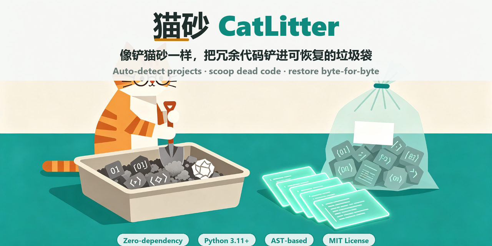
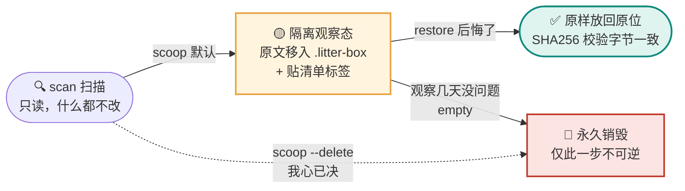

# 🐈 猫砂 CatLitter — 像铲猫砂一样清理冗余代码

<p align="center">
  <b>猫砂模型（CatLitter Model）冗余代码清理器 · The cat-litter redundant-code cleaner</b><br>
  <i>Auto-detect your project, scoop dead code into a restorable garbage bag, and throw it away only when you are sure.</i><br><br>
  <a href="https://github.com/mamaruinvnv-creator/catlitter/actions/workflows/ci.yml"></a>
  
  
  
  
  <a href="https://github.com/mamaruinvnv-creator/catlitter/releases"></a>
  <br>
  <b>⭐ 如果这个思路对你有启发，点个 Star 就是对作者最大的支持！</b>
</p>

---

<p align="center">
  
</p>

---

## 这是什么？猫砂模型（CatLitter Model）

> **把废物像铲猫砂一样铲进垃圾袋：先打包封存、记录在案，确认没问题再扔掉；后悔了随时原样复原。**

**猫砂（CatLitter）** 是一套清理冗余代码的方法论，本仓库是它的参考实现——零依赖的命令行工具（命令名 `litter-scoop`）与 Python 库：它会**自动识别你的项目类型**（Python / Node-TS-JS / Go / Rust / JVM / C 系 …），挑选最合适的冗余代码检测器，找出未使用的导入、死函数、不可达代码、注释掉的旧代码、空文件、重复文件、编辑器备份残留等"废物"，然后按**猫砂模型**处理：

```
                        ┌─────────────────────────────┐
   你的项目  ── scan ──▶ │  冗余清单（什么、在哪、为什么） │
                        └──────────────┬──────────────┘
                                       │ scoop
                    ┌──────────────────┴──────────────────┐
                    ▼                                       ▼
          ┌──────────────────┐                   ┌──────────────────┐
          │  .litter-box 垃圾袋 │  restore 复原      │  --delete 直接扔掉 │
          │ 原始副本+清单 manifest│ ───────────────▶  │ 只留删除记录       │
          └──────────────────┘                   └──────────────────┘
                    │ empty
                    ▼
             永久销毁（仅此一步不可逆）
```

**核心安全承诺**：默认模式下，任何文件被修改前，其**完整原始副本**都会封存在 `.litter-box/` 垃圾袋中，`restore` 一条命令即可**字节级还原**；只有显式执行 `empty` 才会真正销毁。

---

## 核心差异：三态安全模型（Three-State Safety Model）

传统清理工具只有「删 / 不删」两个选项，删错一次代价很大。猫砂模型在中间加了一个**隔离观察态**，把清理拆成三个心理负担完全不同的状态——**默认永远停在可逆状态，只有你两次显式确认才会真正销毁**：



| 状态 | 命令 | 原文件内容 | 留下的记录 | 可逆吗 |
|---|---|---|---|---|
| 🔍 **扫描** | `scan` | 原封不动 | 一份冗余报告 | —（只读） |
| 🟡 **隔离观察（默认）** | `scoop` | 完整原件封存在 `.litter-box/files/`，原位移除 | manifest：规则、原因、行号、原路径、**SHA256** | ✅ `restore` 字节级放回 |
| 🔴 **永久销毁** | `scoop --delete` 或事后 `empty` | 真删 | 只留"删过什么"的清单 | ❌ 不可逆 |

> **安全承诺**：默认路径下，任何文件被改动前都先封存完整原始副本；`restore` 放回后会重新计算哈希，与清理前不一致会直接报错——不是"看起来恢复了"，是逐字节证明恢复了。

### 和你已经熟悉的方案到底差在哪

| 方案 | 删完能找回吗 | 知道"为什么删、属于哪一批"吗 | 回滚粒度 |
|---|---|---|---|
| 直接 Delete | ❌ | ❌ | — |
| 系统回收站 | ✅ 但和所有垃圾混在一起 | ❌ 不记原因、不记项目、不记批次 | 手动一个个挑 |
| **git 回滚** | 未提交的代码 git 里根本没有；且一回滚就是**整个仓库回到过去** | 只到 commit 粒度 | 全仓库 |
| linter / vulture / ruff | 只报警或直接 autofix，**没有"先隔离观察"这个中间态** | 报规则，但不封存原件 | 单处 |
| **🐈 猫砂 CatLitter** | ✅ 默认封存，逐批撤销，哈希校验 | ✅ 每处都带规则/原因/指纹/批次 | **只回滚这一批被判废物的，其余不动** |

一句话：**猫砂的创新不在"找得最准"，而在让你"敢清理"——把不可逆的删除，变成可观察、可审计、可逐批反悔的流程。**

## 特性

- **项目自动适配**：根据 `pyproject.toml` / `package.json` / `go.mod` / `Cargo.toml` / `pom.xml` 等标志文件与语言代码行数，自动决定启用哪些检测器，并识别 React/Vue/Next/Django/Flask/FastAPI 等框架。
- **多语言规则**：
  - Python：基于标准库 `ast` 的精确分析（不是正则猜的）；
  - JS/TS/JSX/TSX/Vue/Svelte：带字符串/注释掩码的词法分析，不会把字符串里的 `console.log` 当调试语句；
  - 全部语言：空文件、字节级重复文件、`.bak/.orig/~/.old/.swp` 备份残留、注释代码块。
- **保守优先**：装饰器注册的函数、`__all__` 导出、`__dunder__`、`if __name__ == "__main__"`、测试文件、`import *`、re-export 全部自动豁免，压低误报。
- **三档置信度**（high / medium / low），可只清理高置信项。
- **三种报告**：终端彩色文本、机器可读 JSON、可离线打开、带筛选的单文件 HTML。
- **零运行时依赖**，Python 3.11+ 即可，Windows / macOS / Linux 通吃。
- 自动尊重 `.gitignore` / `.litterignore`，默认要求 git 工作区干净才动手。
- **顺带铲屎电脑垃圾**（`janitor` 子命令）：同一套猫砂安全模型清理系统临时文件/包管理器缓存，支持计划任务定期执行。

## 安装

```bash
# 方式一：克隆后以可编辑模式安装（推荐开发者）
git clone https://github.com/mamaruinvnv-creator/catlitter.git
cd catlitter
pip install -e .

# 方式二：直接用 pip（发布到 PyPI 后）
pip install litter-scoop

# 不安装也能跑
python -m litter_scoop --help
```

## 5 分钟上手

```bash
# 0. 看看它怎么识别你的项目（只读）
litter-scoop adapt

# 1. 只扫描、不动文件
litter-scoop scan
litter-scoop scan --report html -o litter-report.html   # 可视化报告
litter-scoop scan --min-severity medium                 # 只看中等置信以上
litter-scoop scan --rule unused-import unreachable-code # 只看指定规则

# 2. 铲进垃圾袋（可恢复）。先加 --dry-run 预览最稳妥
litter-scoop scoop --dry-run
litter-scoop scoop -y                  # -y 跳过确认
litter-scoop scoop --min-severity high -y

# 3. 看看垃圾袋里有什么
litter-scoop bags

# 4. 后悔了？字节级恢复
litter-scoop restore <批次号> -y

# 5. 跑几天确认没问题，再永久清空垃圾袋
litter-scoop empty -y

# 或者：我心已决，直接扔掉（只留删除清单，不可恢复）
litter-scoop scoop --delete -y
```

## 检测规则一览

| 规则 id | 适用 | 说明 | 默认置信度 |
|---|---|---|---|
| `unused-import` | Python / JS·TS | 导入后从未使用 | 中 |
| `unused-toplevel-symbol` | Python | 顶层函数/类全项目无引用 | 中 |
| `unused-local` | Python | 赋值后从未读取的局部变量 | 中 |
| `unreachable-code` | Python | return/raise/break/continue 之后的语句 | 高 |
| `duplicate-definition` | Python | 同名函数/类被重复定义覆盖 | 高 |
| `empty-stub` | Python | 只剩 docstring + `pass`/`...` 的空壳 | 低 |
| `unused-top-level-function` | JS·TS | 未导出且从未调用的函数 | 低 |
| `unused-debug-statement` | JS·TS | 遗留的 `console.*` / `debugger` | 低 |
| `commented-code` | 全部 | 连续 ≥3 行被注释掉的疑似代码 | 低 |
| `empty-file` | 全部 | 只有空白的文件 | 高 |
| `duplicate-file` | 全部 | 与另一文件字节完全相同 | 高 |
| `backup-file` | 全部 | `.bak/.orig/.old/~/.swp/.tmp` 残留 | 中 |

## 配置（可选）

在项目根目录放一份 `litterbox.toml`（可由 `litter-scoop init` 生成，模板见 [`litterbox.example.toml`](litterbox.example.toml)）：

```toml
[litterbox]
bag_dir = ".litter-box"
min_severity = "low"
require_clean_git = true
detect_commented_code = true
exclude = ["docs/**", "migrations/**"]

[rules]
"empty-stub" = false        # 关掉某条规则

[adapters]
"web" = false               # 关掉整个 JS/TS 检测器
```

## 垃圾袋目录结构

```
.litter-box/
├── index.json                       # 批次索引
├── manifests/
│   └── 20260905-152950-1a20.json    # 每批一张"垃圾袋标签"：原因/原路径/哈希
└── files/
    └── 20260905-152950-1a20/        # 镜像原项目路径的完整原始副本
        └── src/app.py
```

## 顺带铲屎：定期清理电脑垃圾（janitor）

除了代码里的冗余，猫砂也能铲**电脑里的垃圾**——同一套"先装袋、可恢复、确认再删"的模型，系统垃圾默认封存在独立的全局垃圾袋 `~/.catlitter-janitor/`（可用 `CATLITTER_JANITOR_BAG` 或 `--bag-dir` 改位置），不污染任何项目。

```bash
# 1. 只读扫描：看看哪些目录有多少天前的旧垃圾（默认只统计 7 天前的文件）
litter-scoop janitor scan
litter-scoop janitor scan --json                       # 机器可读
litter-scoop janitor scan --max-age-days 30            # 只看 30 天前的
litter-scoop janitor scan --category user-temp npm-cache   # 只看指定类别

# 2. 铲进系统垃圾袋（可恢复），先 --dry-run 预览
litter-scoop janitor scoop --dry-run
litter-scoop janitor scoop -y

# 3. 查看 / 恢复 / 永久清空（与代码垃圾袋用法一致）
litter-scoop janitor bags
litter-scoop janitor restore <批次号> -y
litter-scoop janitor empty -y

# 4. 我心已决：直接删除超龄垃圾（定时任务用这个）
litter-scoop janitor scoop --delete --max-age-days 7 -y

# 5. 只清理我指定的目录（不碰系统默认位置）
litter-scoop janitor scoop --no-default --extra-path D:/some/tmp -y
```

**默认白名单（只碰这些公认的垃圾位置，绝不碰用户文档）：**

| 平台 | 类别 | 位置 |
|---|---|---|
| Windows | `user-temp` | `%TEMP%` 用户临时目录 |
| Windows | `windows-temp` | `C:\Windows\Temp`（无权限自动跳过） |
| Windows | `pip-cache` / `npm-cache` / `yarn-cache` | 各包管理器缓存 |
| Windows | `thumbcache` | 资源管理器缩略图/图标缓存 |
| Windows | `recycle-bin` | 回收站（**高风险，默认关闭，仅 `--delete` 模式**） |
| macOS | `user-cache` | `~/Library/Caches`、`~/.npm` |
| macOS | `trash` | 废纸篓（同上，默认关闭） |
| Linux | `user-cache` / `tmp-files` | `~/.cache`、`/tmp`（只清当前用户拥有的文件） |
| Linux | `trash` | `~/.local/share/Trash`（默认关闭） |

**四重安全设计：**

1. **白名单制**：只扫描上表固定位置，`--extra-path` 追加的目录也要显式给出；
2. **年龄门槛**：默认只动 7 天前的文件，正在使用的临时文件绝不碰（`--max-age-days 0` 可关闭）；
3. **默认装袋**：清理=移动到全局垃圾袋并记录清单，`restore` 原样移回；只有 `--delete` 才真删；
4. **防链接逃逸**：不跟随符号链接/junction，并校验每个文件物理上确实位于白名单根目录内，防止链接把清理"引"到别处。

### 定期自动清理

```bash
# 预览将要安装的计划任务（不安装）
litter-scoop janitor schedule --print --freq weekly --at 10:00 --day SUN
# 安装：Windows 写入任务计划程序（schtasks），macOS/Linux 写入 crontab
litter-scoop janitor schedule --install --freq weekly --at 10:00
# 卸载
litter-scoop janitor schedule --uninstall
```

安装后每周日 10:00 自动执行 `janitor scoop -y --delete`（直接删除 7 天前的垃圾），日志写在 `~/.catlitter-janitor/janitor.log`。想更稳妥可把任务命令里的 `--delete` 去掉，改为先装袋、你想起来时再 `empty`。

## 作为 Python 库使用

```python
from pathlib import Path
from litter_scoop import scan_project, GarbageBag
from litter_scoop.config import Config

root = Path("./my-project")
result = scan_project(root)
print(result.profile.summary())
for f in result.findings:
    print(f.path, f.start_line, f.rule_id, f.message)

cfg = Config()
cfg.require_clean_git = False
bag = GarbageBag(root, cfg)
batch = bag.scoop([f for f in result.findings if f.severity.value != "low"])
print(batch.batch_id)
# bag.restore(batch.batch_id)

# 系统垃圾清理（janitor）
from litter_scoop import scan_system, JanitorBag
from litter_scoop.janitor import discover_targets

targets = discover_targets(only=["user-temp", "npm-cache"])
report = scan_system(max_age_days=14, targets=targets)
print(report.total_files, report.total_bytes)
sys_bag = JanitorBag()                 # ~/.catlitter-janitor
# batch = sys_bag.scoop(report.files)  # 装袋；sys_bag.restore(batch.batch_id)
```

## 开发

```bash
pip install -e ".[dev]"
pytest                      # 22 个测试（含铲入→恢复字节一致性往返测试）
python -m litter_scoop -C tests/fixtures/sample_project scan
```

项目布局：

```
src/litter_scoop/
├── cli.py              # 命令行入口
├── engine.py           # 扫描引擎：调度适配器、跨文件名字索引
├── project.py          # 项目指纹 & 适配器自动选择
├── ignore.py           # .gitignore 子集实现
├── config.py           # litterbox.toml
├── models.py           # Finding / ProjectProfile / BagBatch
├── scoop.py            # 猫砂模型：装袋/恢复/清空
├── adapters/           # python / web / generic 三个检测器
└── reporters/          # text / json / html 三种报告
```

## 路线图

- [ ] 增量模式：只扫描 git 变更文件
- [ ] autofix 安全规则（仅 `unused-import` 直接重写）
- [ ] SARIF 输出，接入 GitHub Code Scanning
- [ ] Go / Java / Rust 的 AST 级适配器（当前为通用词法规则）
- [ ] janitor：浏览器缓存清理（Chrome/Edge，默认关闭）、清理结果系统通知

## English TL;DR

**CatLitter** treats redundant code like cat litter: `scan` finds it, `scoop`
seals a pristine copy into `.litter-box/` (fully restorable via `restore`),
and only `empty` is irreversible. It auto-detects your project type, needs
**zero dependencies**, runs on Python 3.11+, and covers Python (AST-based),
JS/TS and language-agnostic waste. PRs and issues are welcome — and if you
like the idea, please **⭐ Star** it.

## 参与贡献

Issue 报误报/漏报、PR 新语言适配器都非常欢迎。提交前请跑 `pytest` 保证全绿。

## License

MIT，见 [LICENSE](LICENSE)。

<p align="center"><b>觉得有用？点右上角 ⭐ Star 支持一下，这是猫砂持续铲屎的动力。</b></p>
